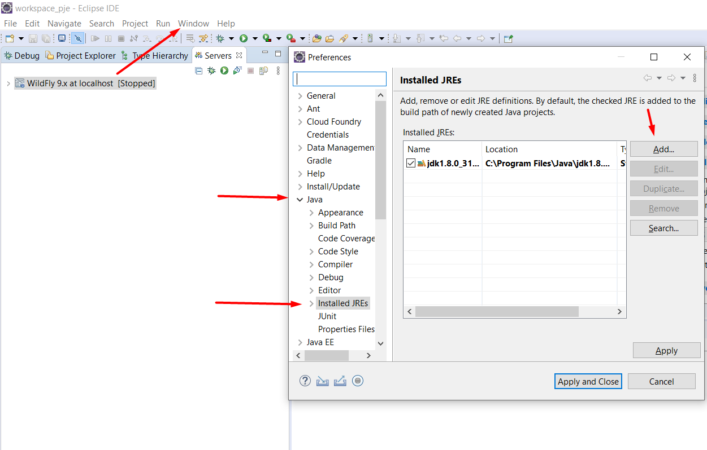
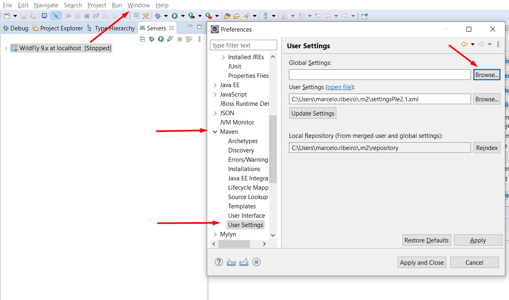
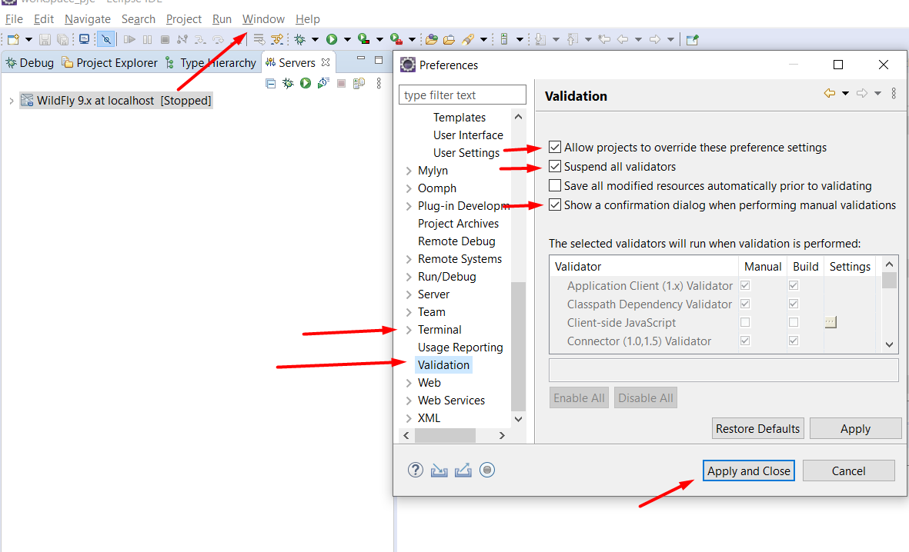

# Ambiente de Desenvolvimento - PJE

Apresentação de criação do ambiente de desenvolvimento do PJe  

## Conteúdo

- [Configurações mínima da máquina](#config-minima-maquina)
- [Pré-requisitos](#pré-requisitos)
- [Configuração do Wildfly](#config-wildfly)  
- [Clonando o projeto](#clonando-projeto)  
- [Configuração do Eclipse](#config-eclipse)  
- [Configuração do Servidor](#config-servidor)  
- [Sugestão para melhorar o ambiente de desenvolvimento](#config-servidor)  

## Configurações mínima da máquina

Para subir o ambiente será necessário ter uma máquina com no mínimo as seguintes configurações:

- 8GB de RAM
- Processador Core i7
- Mínimo de 256GB de Armazenamento

Tendo essas configurações o ambiente irá subir tranquilamente

## Pré-requisitos 

Estas são as instalações e configurações necessárias para executar o projeto.

Para executar este projeto é necessário instalar:

- Apache Maven 3.8.6 - https://maven.apache.org/download.cgi
- Java 1.8
- Eclipse IDE 2022‑09 - https://www.eclipse.org/downloads/download.php?file=/oomph/epp/2022-09/R/eclipse-inst-jre-win64.exe
- Git - https://github.com/git-for-windows/git/releases/download/v2.38.1.windows.1/Git-2.38.1-64-bit.exe
- Wildfly

**Obs: Será disponibilizado uma pasta com o restante dos arquivos que não tem link para download. O link do repositório é: https://maven.apache.org/download.cgi**  

1. Após a instalação é necessário configurar as variaveis de ambiente:

   - JAVA_HOME - Apontando para o local de instalação do Java
   - MAVEN_HOME - Apontando para o local de instalação do Maven
   - M2_HOME - Apontando para o local de instalação do Maven
   - PATH - Adicionar "%JAVA_HOME%\bin" e "%M2_HOME%\bin"

2. Após intatalações e configurações verifique se o ambiente está pronto:

- Execute o seguinte comando no terminal 

            java -version

- Resultado esperado

            java version "1.8.0_321"
            Java(TM) SE Runtime Environment (build 1.8.0_321-b07)
            Java HotSpot(TM) 64-Bit Server VM (build 25.321-b07, mixed mode)

3. Execute o seguinte comando no terminal:

      mvn -version

- Resultado esperado

            Apache Maven 3.8.6 (3599d3414f046de2324203b78ddcf9b5e4388aa0)
            Maven home: ...\apache-maven-3.8.6
            Java version: 1.8.0_321

4. Como organização, pedimos aos desenvolvedores criarem as seguintes pastas na C: para uma melhor organização:

   - Desenvolvimento - Com as seguintes subpastas:
     
       - Server -> Nessa pasta irá ficar o WildFly que são as configurações do Servidor
       
       - Projeto -> Nessa pasta irá ficar o projeto do PJe
       
         

## Configuração do Wildfly

1. Extrair do arquivo **wildfly_pje2.1_cnj.7z** na pasta: C:\Desenvolvimento\Server

2. Inserir os drivers do PostgreSQl para conexão com o banco

- No caminho: C:\Desenvolvimento\Server\wildfly_pje2.1_cnj\modules\system\layers\base\org\postgresql\main inserir os seguintes arquivos que está no repositorio na subpasta **Drivers Postgresql**:
    - postgresql-42.2.6.jar
    
    - postgresql-9.2-1002.jdbc4.jar
    
    - module.xml
    
3. Inserir os arquivos que estão na pasta **StandAlone Pje** em: C:\Desenvolvimento\Server\wildfly_pje2_cnj\standalone\configuration
      

## Clonando o projeto

1. Clonar repositório git utilizando o comando na pasta **C:\Desenvolvimento\Projetos**:

         git clone http://gitlab.tjba.jus.br/setim/din/cosis/judicial/pje/pje_tjba.git

## Configuração do Eclipse

As configurações na IDE ...

1. Importando o Maven 

    - Ir na aba **File** -> **Import** -> Buscar por **Maven** e ir em -> **Existing Maven Projects**

2. Configurando o Maven 

Ir na pasta oculta **.m2** do usuário da sua máquina que está em: C:\Users e inserir o arquivo **SettingsPJe2.1** que esta na pasta dos arquivos disponibilizadas na seção: Pré-Requisitos

Após isso no eclipse realizar o seguinte passo a passo para configuração do maven:

- Ir na aba **Window** -> **Preferences** -> **Maven** -> **User Settings**
- Após isso, clicar em Browse em Global Settings e selecionar o **SettingsPJe2.1** da pasta **.m2** na pasta do seu usário

3. Adicionando o JDK no Eclipse

- Ir na aba **Window** -> **Preferences** -> **Java** e adicionar a pasta **jdk 1.8**
    - **Add** -> **Standard VM** -> **JRE Home** (Selecionar a pasta do JDK) e clicar em **Finish**
    
    - Após isso, selecionar o **jdk 1.8 clicando no checkbox** e dar o **Apply and Close**
    
      
## Configuração do Servidor

- Ir em **Servers** -> JBoss Community -> Escolher o Wildfly 9x -> Selecionar o Standalone

## Sugestão para melhorar o ambiente de desenvolvimento

1. Configurando o Validation do Eclipse

Verificamos algumas configurações do eclipse para ter uma melhor produtividade e um dos pontos que ocasiona demora ao subir o ambiente e são as validações que ele roda. Vamos inativar essa validações.

- Ir na aba **Window** -> **Preferences** -> **Terminal** -> **Validation**
- E setar os seguintes checkbox:
    - Allow projects to override these preference settings
    - Suspend all validators
    - Show a confirmation dialog when perfoming manual validations

